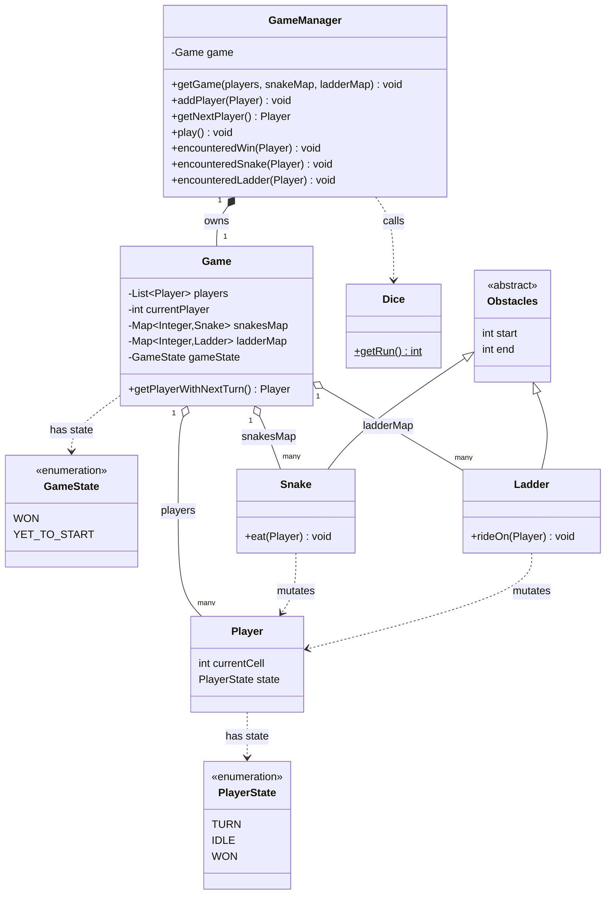

# Snakes and Ladders — LLD Documentation

A low-level object-oriented design of the classic Snakes and Ladders board game, implemented in Java.

## Problem Statement

Model a multiplayer Snakes and Ladders game on a linear (logically 2D, but modeled as 1-D) 100-cell board. Players take turns rolling a dice, move forward by the rolled amount, and may be sent backward by a snake or forward by a ladder if they land on one. The first player to reach cell 100 wins, ending the game.

## Functional Requirements

**Implemented:**
- Multiple players tracked in a single game (`Game.players`).
- Turn order maintained in O(1) via a circular index (`Game.getPlayerWithNextTurn()` using modulo).
- Dice roll as a simple random function, 1–6 (`Dice.getRun()`).
- Static snake and ladder placements looked up by cell number (`Game.snakesMap`, `Game.ladderMap`).
- Win detection when a player's current position is exactly cell 100 (`GameManager.encounteredWin`).
- Ordinary move: `GameManager.play()` writes `player.setCurrentCell(finalCell)` **unconditionally**, right after rolling — before any win/obstacle check runs — so every roll advances the player, and obstacle resolution (if any) then applies on top of that.
- Snake "bite" / Ladder "climb" now actually fires: because `play()` writes `finalCell` to the player *before* calling `encounteredLadder`/`encounteredSnake`, the internal `this.start == player.currentCell` guard inside `Ladder.rideOn`/`Snake.eat` is satisfied (the lookup key and the player's current cell are the same value), and the teleport to `this.end` goes through. This was broken in an earlier version of this code.

**Partially Implemented:**
- Dice "can be controlled" per the design notes (`read.me.md`), but the implementation only exposes a static `getRun()` with no seed, interface, or injection point — it cannot actually be controlled/mocked.
- `PlayerState` declares three values (`TURN`, `IDLE`, `WON`), but only `WON` is ever assigned anywhere in the codebase. The `if (PlayerState.IDLE.equals(player.getState())) return;` guard at the top of `play()` is therefore dead code — no code path ever sets a player's state to `IDLE`.

**Planned but Not Implemented:**
- `Player.play()` / `Player.step()` — the original entity design (`read.me.md`) gives `Player` behavior methods; the actual `Player` class is a pure data holder (Lombok `@Data`) with no methods of its own.
- `Game.step()` — the design calls for the step/turn logic to live on `Game`; it was instead implemented as `GameManager.play()`.
- Any driver/`main` entry point that runs a full game to completion.
- Overshoot handling (e.g., rolling past cell 100).
- Any guard preventing a win cell from also being a snake/ladder start, or preventing a ladder's landing cell from also being a snake's start (see Gaps for why this matters with the current call order).

## Architecture Overview

**Relationships:**

| From | To | Kind | Notes |
|---|---|---|---|
| `GameManager` | `Game` | Composition | Manager lazily creates and holds exactly one `Game`; no other object references it. |
| `Game` | `Player` | Aggregation | Players are constructed externally and passed in; they can outlive the `Game`. |
| `Game` | `Snake` / `Ladder` | Aggregation | Stored as `Map<Integer, Snake/Ladder>` keyed by board cell. |
| `Game` | `GameState` | Dependency (field) | Simple enum field, no behavior attached. |
| `Player` | `PlayerState` | Dependency (field) | Simple enum field. |
| `Snake`, `Ladder` | `Obstacles` | Inheritance | Both extend the abstract `Obstacles` (`start`, `end`). |
| `GameManager` | `Dice` | Dependency | Static call, no held reference. |
| `Snake.eat` / `Ladder.rideOn` | `Player` | Dependency | Called with a `Player` reference to mutate its cell. |

## Class-by-Class Reference

### `Game`
Purpose: holds the full state of a single game in progress — the players, the board's obstacles, and whose turn it is.

- **Fields**
  - `players: List<Player>` — all participants.
  - `currentPlayer: int` — index of the player who played last (default `0`); used to compute the next turn.
  - `snakesMap: Map<Integer, Snake>` — snakes keyed by their head/start cell.
  - `ladderMap: Map<Integer, Ladder>` — ladders keyed by their foot/start cell.
  - `gameState: GameState` — `YET_TO_START` or `WON`.
- **Public methods**
  - `Game(List<Player>, Map<Integer,Snake>, Map<Integer,Ladder>)` — constructor; always initializes `gameState` to `YET_TO_START`.
  - `getPlayerWithNextTurn(): Player` — advances `currentPlayer` by `1 mod players.size()` **before** returning, then returns that player. Side effect: mutates `currentPlayer` on every call, including when the game is already over (see Gaps — off-by-one on the very first call).
  - Lombok `@Data`/`@AllArgsConstructor`/`@NoArgsConstructor` generate the getters/setters/all-args constructor used elsewhere (e.g. `game.getPlayers()`, `game.getGameState()`, `game.setGameState()`).

### `GameManager`
Purpose: the controller that drives a turn — the closest thing to the "engine" of the game.

- **Fields**
  - `game: Game` — the single game instance it manages (created once, never replaced).
- **Public methods** (all package-private, no `public` modifier)
  - `getGame(players, snakeMap, ladderMap): void` — lazily constructs `game` if one doesn't exist yet. Despite the name, it does not return anything (likely a naming leftover from "create or get").
  - `addPlayer(Player): void` — appends a player to the live game's player list, but only while `gameState == YET_TO_START`.
  - `getNextPlayer(): Player` — delegates to `game.getPlayerWithNextTurn()`.
  - `play(): void` — orchestrates one turn: fetches the next player (which always advances `currentPlayer`); returns early without rolling if `gameState == WON` or the fetched player's state is `IDLE` (the latter check is dead code — see Partially Implemented). Otherwise rolls the dice, computes `finalCell = currentCell + run`, and **immediately and unconditionally** writes it via `player.setCurrentCell(finalCell)`. It then calls `encounteredWin(player)`, `encounteredLadder(player)`, `encounteredSnake(player)` **in that fixed order, with no short-circuiting** — all three always run regardless of what the previous one did. See Key Flows / Gaps for the consequences.
  - `encounteredWin(Player): void` — if `player.getCurrentCell() == 100` (already written by `play()`), sets `game.gameState = WON` and `player.state = WON`.
  - `encounteredSnake(Player): void` — looks up `game.snakesMap.get(player.getCurrentCell())` — the player's *current*, already-written cell, re-read at call time — and if a snake is keyed there, delegates to `Snake.eat(player)`. No result is returned to `play()`.
  - `encounteredLadder(Player): void` — same shape as `encounteredSnake`, delegating to `Ladder.rideOn(player)`.

### `Player`
Purpose: a participant in the game — just their current position and state. Pure data holder (Lombok `@Data`), no behavior.

- **Fields**
  - `currentCell: int` — board position (not explicitly initialized; defaults to `0`).
  - `state: PlayerState` — one of `TURN`, `IDLE`, `WON`. Only `WON` is ever assigned (by `GameManager.encounteredWin`); `TURN` and `IDLE` are declared but never set anywhere in the codebase, so a `Player`'s state is always either `null` or `WON`.

### `Dice`
Purpose: models a single six-sided die roll.

- **Public methods**
  - `static getRun(): int` — returns a random integer in `[1, 6]` via `new Random().nextInt(6) + 1`. A new `Random` instance is created on every call.

### `Obstacles` (abstract)
Purpose: shared shape for anything that teleports a player from one cell to another (a snake or a ladder).

- **Fields**: `start: int`, `end: int` — both package-private, no constructor, no validation (e.g. nothing enforces `start > end` for a snake or `start < end` for a ladder, or that either is within `1..100`).

### `Snake extends Obstacles`
Purpose: models a snake that drops a player from its head to its tail.

- **Public methods**
  - `eat(Player): void` — validates `this.start == player.currentCell` before teleporting the player to `this.end`. At the point `GameManager` calls this, `player.currentCell` has already been set to the cell used to look the snake up in `snakesMap`, so this check now passes in the ordinary case (see Functional Requirements).

### `Ladder extends Obstacles`
Purpose: models a ladder that lifts a player from its foot to its top.

- **Public methods**
  - `rideOn(Player): void` — same shape as `Snake.eat`: validates `this.start == player.currentCell`, then teleports the player to `this.end`.

### `GameState` (enum)
`WON`, `YET_TO_START` — no "in progress" state exists; the game is either not started or already won.

### `PlayerState` (enum)
`TURN`, `IDLE`, `WON` — only `WON` is ever assigned (by `encounteredWin`). `TURN` and `IDLE` are both dead values; in particular the `IDLE` check in `play()` can never be true.

## Design Patterns Used

No design pattern is fully and correctly realized in this codebase.

- **Inheritance only, not Strategy**: `Snake` and `Ladder` both extend `Obstacles`, but they expose *different* method names (`eat` vs `rideOn`) rather than a shared interface method. Because of this, `GameManager` cannot treat them polymorphically — it has two separate methods (`encounteredSnake`, `encounteredLadder`) with near-duplicate logic (map lookup + null check + delegate call) instead of one. This is inheritance for field reuse, not a Strategy pattern.
- No Factory, Singleton, Observer, or State pattern is present. `GameState`/`PlayerState` are plain enums driven by `if`/`equals` checks in `GameManager`, not a State pattern (no per-state behavior classes).

**Potential Improvements**
- Unify `Snake`/`Ladder` behind a common method, e.g. `Obstacles.applyEffect(Player player)`, so `GameManager` can do a single `obstaclesMap.get(cell)` + polymorphic call instead of two near-identical methods — this is the textbook case for the Strategy pattern.
- A `Board` abstraction owning the snake/ladder maps and exposing something like `Board.resolveFinalCell(int)` would decouple `GameManager` from raw map lookups and make cell-bounds/overlap validation (see Gaps) a single enforced place.

## Key Flows

### Flow: Initialize a game
1. Client calls `GameManager.getGame(players, snakeMap, ladderMap)`.
2. If no `Game` exists yet, `GameManager` constructs one; `gameState` starts as `YET_TO_START`.
3. Calling `getGame` again with a different player list/maps has no effect — the first call wins (`if (game == null)` guard).

### Flow: Add a player
1. Client calls `GameManager.addPlayer(player)`.
2. If `game.gameState != YET_TO_START`, the call is a silent no-op.
3. Otherwise the player is appended to `game.players`.

### Flow: Play a turn
1. Client calls `GameManager.play()`.
2. `GameManager` calls `getNextPlayer()` → `Game.getPlayerWithNextTurn()`, which **always** advances `currentPlayer` first, even if the game has already been won (see Gaps).
3. If `game.gameState == WON`, `play()` returns immediately — the dice is never rolled. (The turn pointer from step 2 has already moved, regardless.)
4. If the fetched player's state is `PlayerState.IDLE`, `play()` also returns early — in practice this branch is unreachable, since nothing in the codebase ever sets a player's state to `IDLE` (see Gaps).
5. `Dice.getRun()` produces a 1–6 roll; `finalCell = player.getCurrentCell() + run` is computed.
6. `player.setCurrentCell(finalCell)` runs **immediately and unconditionally** — the player's position is updated before any win/obstacle check happens.
7. `encounteredWin(player)` runs: if `player.getCurrentCell()` (== `finalCell`) is `100`, it marks the game `WON` and the player `WON`. There is **no early return** here — execution always continues to the next two checks.
8. `encounteredLadder(player)` runs: looks up `ladderMap` by the player's *current* cell; if a ladder is keyed there, `Ladder.rideOn` confirms `this.start == player.currentCell` (true, since that's the very key used to find it) and moves the player to `this.end`.
9. `encounteredSnake(player)` runs last: looks up `snakeMap` by the player's *current* cell **re-read at this point** — which, if step 8 just moved the player via a ladder, is the ladder's landing cell, not the original `finalCell`. If a snake happens to be keyed at that landing cell, it bites immediately in the same turn (see Gaps — ladder→snake chaining).
10. **Gap:** if `finalCell == 100` also happens to be a ladder or snake start (nothing in the code prevents this), the obstacle step still runs after `encounteredWin` already recorded the win, moving `player.currentCell` away from `100` even though `game.gameState` and `player.state` both already say `WON`.

## Gaps & TODOs

- **No short-circuiting between win/ladder/snake checks.** `play()` calls `encounteredWin`, `encounteredLadder`, and `encounteredSnake` back-to-back with no early return between them. If the winning cell (`100`) is also mapped as a ladder or snake start, the obstacle check still fires after the win is recorded, silently moving the player off cell `100` while `game.gameState`/`player.state` still report `WON`.
- **Ladder→snake chaining within one turn.** `encounteredSnake` looks up `snakeMap` using `player.getCurrentCell()` read *after* `encounteredLadder` may have already moved the player. Landing on a ladder whose end cell happens to also be a mapped snake's start causes an immediate bite in the same roll, with nothing distinguishing "climbed then bitten" from an ordinary single-event turn. Nothing in `read.me.md` calls for this chaining — it looks like an unintended side effect of reading `player.getCurrentCell()` fresh in each `encountered*` method rather than passing the original `finalCell` through.
- **`PlayerState.IDLE` is dead code, and `TURN` is never used.** Nothing in the codebase ever assigns `PlayerState.IDLE` to a player, so the `if (PlayerState.IDLE.equals(player.getState())) return;` guard at the top of `play()` can never trigger. `PlayerState.TURN` is similarly never assigned. In practice a `Player`'s `state` is always either `null` or `WON`.
- **Off-by-one on the first turn.** `Game.currentPlayer` starts at `0`, but `getPlayerWithNextTurn()` increments *before* reading, so the very first call returns `players.get(1)`, not `players.get(0)` — player 0 never gets the opening turn.
- **`getPlayerWithNextTurn()` mutates state even when not needed.** `GameManager.play()` calls `getNextPlayer()` (which advances the turn pointer) *before* checking `gameState == WON`, so even after the game is over, each subsequent `play()` call keeps rotating the turn pointer.
- **No overshoot/bounds handling.** A roll that would take a player past cell 100 (e.g. `currentCell=98, run=5 → finalCell=103`) is not detected or clamped — `encounteredWin` only checks `== 100`.
- **No "in progress" `GameState`.** Only `YET_TO_START` and `WON` exist; there's no explicit state for a game actively being played.
- **No `Board` abstraction or bounds/overlap validation** on `Obstacles` (`start`/`end` are unchecked ints — nothing stops a snake and ladder sharing a start cell, nothing stops an obstacle from being mapped to cell 100 itself, which directly interacts with the win-overwrite gap above, and nothing keeps `start`/`end` within `1..100`).
- **No entry point.** All of `GameManager`'s methods are package-private with no `public` modifier, and there is no `main` method or driver loop anywhere in the package — there is no way to actually run a full game to completion from outside the package as it stands.
- **Dice is not controllable.** The original requirement ("Dice can be controlled but for sake of simplicity will be a simple random function") is only half-honored — it's a simple random function, but nothing (interface, seed, injected RNG) makes it controllable/testable.
- **No concurrency handling.** `Game.currentPlayer` and `gameState` are mutated without synchronization; fine for a single-threaded CLI/test harness, but not safe if multiple threads ever call `play()` concurrently.

## Interview Prep Notes

**Why this design?**
The split between `Game` (pure state) and `GameManager` (turn orchestration logic) is a reasonable separation of state vs. behavior, and keying snakes/ladders by a `Map<Integer, Obstacle>` gives O(1) obstacle lookup per cell instead of scanning a list — a sensible choice given the board is static and small (100 cells). Writing `player.currentCell` unconditionally up front (before resolving win/obstacles) is simpler than the alternative of conditionally writing it only on an "ordinary" move, and it's what makes the snake/ladder teleport validation actually work — but the trade-off is that nothing stops the three `encountered*` checks from all firing on the same roll, which is the root of the chaining/overwrite gaps above.

**What would break at scale?**
- `GameManager` holds a single `Game` field — it can only ever run one game at a time; supporting concurrent games would need a `Map<gameId, Game>` plus synchronization on per-game mutable state (`currentPlayer`, `gameState`).
- Everything is in-memory with no persistence — a crash mid-game loses all state; there's also no way to reconstruct a game from an event log for replay/audit.
- `new Random()` on every `Dice.getRun()` call is wasteful at high roll volume (cheap to fix: reuse one `Random`/`ThreadLocalRandom`).

**What would you add next?** (pulled directly from Gaps & TODOs above)
1. Add an early `return` right after `encounteredWin` marks a player `WON`, so a winning player's cell/state can never be further mutated by a same-cell ladder/snake check.
2. Stop `encounteredSnake` from re-reading `player.getCurrentCell()` after `encounteredLadder` may have already changed it — pass the original `finalCell` through explicitly, and only check one obstacle type per turn (or make the chaining an explicit, intentional rule).
3. Decide what `PlayerState.IDLE`/`TURN` are actually for (e.g. "skip a turn") and either wire them up or remove them — right now they're unreachable.
4. Fix the turn-order off-by-one and stop advancing `currentPlayer` once the game is already `WON`.
5. Add overshoot handling (either "must land exactly on 100" or "clamp to 100") and introduce an `IN_PROGRESS` `GameState`.
6. Add a `Board` abstraction to own cell-bounds validation and obstacle overlap checks (including preventing a snake/ladder from being mapped to cell 100 itself).
7. Unify `Snake`/`Ladder` behind one polymorphic method to remove the duplicated lookup logic in `GameManager` (Strategy pattern).
8. Add a public entry point / driver loop that calls `play()` until `gameState == WON`.
