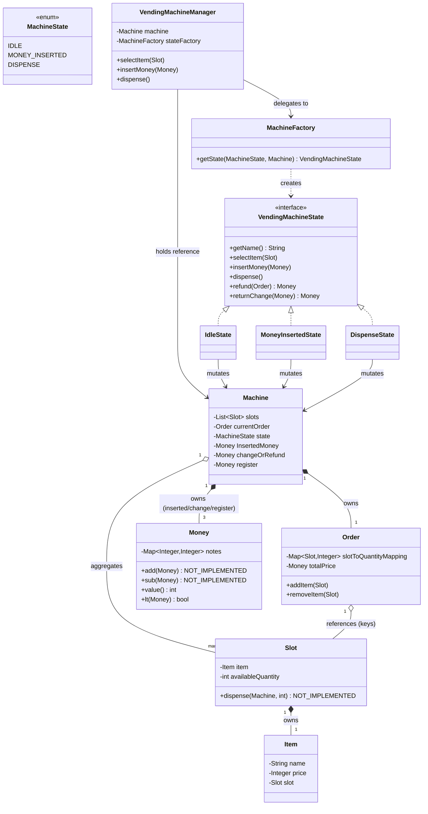

# VendingMachine — LLD Documentation

A low-level design of a coin/note-operated vending machine: select an item, insert money, dispense the item(s), and (ideally) get back change or a refund.

## Problem Statement

Model a physical vending machine that holds multiple item slots. A user selects one or more slots, inserts money, the machine validates it can fulfil the order (stock + correct change), dispenses the items, and returns change. If dispensing partially fails, the machine should be able to refund the user correctly.

## Functional Requirements

**Implemented** (code exists and is wired into a reachable flow, even if buggy):

- User can select a slot, which decrements its stock and adds it to the current order — `IdleState.selectItem` (`impl/IdleState.java:19`). *Broken*: see Gaps.
- `Money` can compute its total value and compare against another `Money`'s value — `Money.value()` / `Money.lt()` (`entities/Money.java:28,39`). **Implemented correctly** as arithmetic, but used with inverted logic at its one call site (see Gaps).
- User can insert money while idle, gated by a price-sufficiency check — `IdleState.insertMoney` (`impl/IdleState.java:26`). *Broken*: see Gaps.
- Machine computes change by greedily deducting from inserted notes, denomination by denomination — `MoneyInsertedState.deductMoney` (`impl/MoneyInsertedState.java:34`). *Unreachable* in practice (see Gaps).
- Machine can compute a refund for an entire order using the same greedy algorithm against the register — `DispenseState.refund` (`impl/DispenseState.java:22`). *Not exposed* via any public API (see Gaps).
- State transitions between `IDLE → MONEY_INSERTED → DISPENSE` exist as an explicit state machine (`entities/MachineState.java`, `impl/MachineFactory.java`).

**Planned, per `read.me.md`, but not implemented:**

- "System must find out whether it can dispense all items in required quantity" before committing — no such pre-check exists anywhere.
- "System must find out whether it can return correct change" before committing — no such pre-check exists anywhere.
- `Money.add(Money)` / `Money.sub(Money)` — both stubs (`entities/Money.java:21,25`), throw `UnsupportedOperationException`.
- `Slot.dispense(Machine, int)` — stub (`entities/Slot.java:19`), throws `UnsupportedOperationException`.
- `Order.totalPrice` — field declared, never computed or assigned anywhere.
- Cancelling/removing a selection via `Order.removeItem` — implemented but never called by any state.
- A public way to trigger `refund()` / `returnChange()` from `VendingMachineManager` — no such methods exist on the manager.

## Architecture Overview

| Class | Package | Role |
|---|---|---|
| `Item` | entities | A product sold by the machine: name + price, back-reference to its `Slot`. |
| `Slot` | entities | A physical compartment holding one `Item` type and a stock count. |
| `Order` | entities | The in-progress basket for the current user session. |
| `Machine` | entities | Aggregate root: slots, current order, current state, and the three money pots (inserted, change/refund, register). |
| `Money` | entities | A denomination→count wallet (e.g. `{100: 2, 50: 1}`). |
| `MachineState` | entities | Enum tag for the machine's current lifecycle stage. |
| `VendingMachineState` | impl | State-pattern contract; every operation defaults to "unsupported in this state." |
| `IdleState` | impl | Behavior while waiting for a selection/payment. |
| `MoneyInsertedState` | impl | Behavior once payment has been accepted, prior to dispensing. |
| `DispenseState` | impl | Behavior for computing refunds/change after dispensing. |
| `MachineFactory` | impl | Builds the concrete state object for a given `MachineState`. |
| `VendingMachineManager` | impl | Thin facade: forwards calls to whatever state `Machine` is currently in. |

### Relationships

- `Machine` **owns** (composition) its `Order` and its three `Money` instances — they're created inline as field initializers and have no life outside a `Machine`.
- `Machine` **aggregates** `List<Slot>` — the list is passed into the constructor, so slots can conceivably be shared/constructed externally.
- `Slot` **owns** (composition) its `Item` — constructed together, and `Slot`'s constructor sets the back-reference (`item.setSlot(this)`).
- `Order` **aggregates** `Slot` — it only holds references (as map keys) to slots that live in `Machine.slots`.
- `VendingMachineManager` **depends on** `Machine` and `MachineFactory` (both held as fields, but used as collaborators rather than owned/composed data).
- `IdleState` / `MoneyInsertedState` / `DispenseState` each hold a dependency reference to `Machine`, which they read and mutate directly.

## Class-by-Class Reference

### `entities.Item`
- **Purpose**: A sellable product.
- **Fields**: `name`, `price` (plain `Integer`, *not* `Money` — a deviation from `read.me.md`'s spec, which calls for `Money price`), `slot` (back-reference, set by `Slot`'s constructor).

### `entities.Slot`
- **Purpose**: One dispensing compartment.
- **Fields**: `item`, `availableQuantity`.
- **Methods**: `dispense(Machine, int)` — **stub**, always throws `UnsupportedOperationException` (`entities/Slot.java:19`).

### `entities.Order`
- **Purpose**: The current user's basket.
- **Fields**: `slotToQuantityMapping` (`Map<Slot,Integer>`), `totalPrice` (declared, **never populated anywhere in the codebase**).
- **Methods**:
  - `addItem(Slot)` — increments the slot's count in the map. **Bug**: does `map.get(slot) + 1` with no existing entry check/default, so the *first* selection of any slot throws `NullPointerException` (unboxing `null + 1`) (`entities/Order.java:14`).
  - `removeItem(Slot)` — decrements and removes the entry at zero. Implemented correctly, but **never called** by any state class.

### `entities.Money`
- **Purpose**: A wallet of denomination → count.
- **Fields**: `notes` (`TreeMap<Integer,Integer>`, reverse-sorted so highest denominations are iterated first — used by the greedy change algorithms).
- **Methods**:
  - `add` / `sub` — both **stubs**, throw `UnsupportedOperationException` (`entities/Money.java:21,25`).
  - `value()` — sums `denomination × count` over all notes to get the wallet's total monetary value (`entities/Money.java:28-37`). Correctly implemented.
  - `lt(Money money)` — now a real value comparison: `null`-safe, returns `money.value() >= this.value()` (`entities/Money.java:39-44`). This fixes the previous NPE-prone, per-denomination comparison. **Naming/semantics caveat**: despite the name `lt` ("less than"), it returns true for *equal* values too (`>=`, not `>`), so it's really an "lte" check — and its one call site uses it backwards (see Gaps).

### `entities.Machine`
- **Purpose**: The vending machine itself; holds all mutable state.
- **Fields**: `slots`, `currentOrder`, `state` (`MachineState`, starts `IDLE`), `InsertedMoney` (note: capitalized field name — a style quirk, not a bug; Lombok still generates `getInsertedMoney()`), `changeOrRefund`, `register` (the machine's own cash reserve, used as the source for refunds).

### `entities.MachineState` (enum)
- **Purpose**: Tags which lifecycle stage the machine is in: `IDLE`, `MONEY_INSERTED`, `DISPENSE`.

### `impl.VendingMachineState` (interface)
- **Purpose**: The State-pattern contract. Every method has a default implementation that throws `UnsupportedOperationException(getName() + " operation is not supported")`, so a concrete state only needs to override the operations it actually supports.

### `impl.IdleState`
- **Purpose**: Behavior while the machine is waiting for a selection and payment.
- `selectItem(Slot)` — no-ops if `availableQuantity == 0`, otherwise **decrements the slot's `availableQuantity`** and then adds the slot to the order (`impl/IdleState.java:20-23`). **Gap**: the decrement happens *before* `order.addItem(slot)`, which still throws its `NullPointerException` on a slot's first selection (see Gaps) — so stock is already decremented with no rollback when that throw happens, leaving the slot's count permanently off by one relative to the (never-recorded) order.
- `insertMoney(Money)` — compares `order.getTotalPrice()` against the inserted money via `totalOrderPrice.lt(money)`, i.e. `money.value() >= totalOrderPrice.value()` — literally "is the payment sufficient?" But the surrounding code treats a **true** result as a reason to `return` (reject) rather than to accept: `if (totalOrderPrice.lt(money)) { return; }` only falls through to accept the money when the check is **false**, i.e. when payment is *insufficient*. The condition is inverted relative to its evident intent. On top of that, `Order.totalPrice` is never computed anywhere, so `totalOrderPrice.value()` is always `0`, making the (inverted) check always true — so in practice this method **still always returns early and never accepts money or transitions state** (`impl/IdleState.java:27-34`), same end-to-end symptom as before the `Money.lt` fix, now traceable to two distinct causes instead of one.

### `impl.MoneyInsertedState`
- **Purpose**: Behavior once money has (nominally) been accepted, before dispensing.
- `dispense()` — for each `(slot, quantity)` in the order, calls `slot.dispense(machine, quantity)` — which is a stub that **always throws**, so this method never completes in its current form (`impl/MoneyInsertedState.java:28`).
- `deductMoney(Map<Slot,Integer>)` (private) — computes `totalPrice` from item prices × quantities, then greedily deducts from `insertedMoney`'s notes (highest denomination first, via the `TreeMap`'s reverse order), leaving the *change* in `insertedMoney` itself, which is then assigned to `machine.changeOrRefund`. Also sets `machine.state = DISPENSE`. **Note**: this assignment happens redundantly *inside* the loop body every iteration rather than once after it — harmless but sloppy. **Gap**: the money actually "kept" by the machine (the portion deducted to cover the price) is never added to `machine.register` — the register is never credited anywhere in the codebase, which breaks the refund flow downstream (see Gaps).

### `impl.DispenseState`
- **Purpose**: Behavior for computing refunds/change after a dispense attempt.
- `refund(Order order)` — computes the order's total value from item prices × quantities, then greedily deducts that amount from `machine.register`'s notes (highest denomination first) into a new `refund` `Money`, crediting nothing back anywhere else. Sets `machine.changeOrRefund` and `machine.state = IDLE`, again redundantly inside the loop. **Edge case**: if `register.getNotes()` is empty, the loop never runs, so `state` is never reset to `IDLE` and an empty `Money` is returned.
- `returnChange(Money money)` — ignores its `money` parameter entirely and just returns `machine.getChangeOrRefund()`.

### `impl.MachineFactory`
- **Purpose**: Factory that maps a `MachineState` enum value to the concrete `VendingMachineState` implementation, via a `switch` expression (`impl/MachineFactory.java:8`).

### `impl.VendingMachineManager`
- **Purpose**: Facade over the state machine. Looks up the current state fresh on every call (`stateFactory.getState(machine.getState(), machine)`) and forwards `selectItem`, `insertMoney`, and `dispense`. **Gap**: no `refund()` or `returnChange()` methods exist on this facade, even though `DispenseState` implements both.

## Design Patterns Used

- **State Pattern** — `VendingMachineState` interface with `IdleState` / `MoneyInsertedState` / `DispenseState` implementations, each handling only the operations valid in that lifecycle stage and defaulting everything else to "unsupported." This lets `VendingMachineManager` stay ignorant of which operations are legal in which state — invalid calls self-report via the exception rather than needing `if/else` checks at the call site.
- **Factory Pattern** — `MachineFactory.getState(MachineState, Machine)` centralizes the mapping from the `MachineState` enum to a concrete state object, so `VendingMachineManager` never references a concrete state class directly.

### Potential Improvements (not currently patterns, but shapes that suggest one)

- `MachineFactory` builds a **brand-new state object on every single call** (`VendingMachineManager.currentState()` calls it each time) rather than caching one instance per `Machine`/state — functionally harmless here since states are stateless wrappers around `Machine`, but it's unnecessary churn; a per-machine cached instance (or a flyweight keyed by enum) would be the natural next step if this needs to scale.
- The greedy denomination-deduction logic is duplicated near-identically between `MoneyInsertedState.deductMoney` and `DispenseState.refund` — this is a candidate to extract into a shared `Money` method (ironically, exactly what `Money.sub`/`add` seem intended for but are stubbed out).

## Key Flows

**Flow: Select an item**
1. Client calls `VendingMachineManager.selectItem(slot)`.
2. Manager resolves the current state (machine starts `IDLE`) and calls `IdleState.selectItem(slot)`.
3. If the slot is out of stock, it's a no-op.
4. Otherwise the slot's `availableQuantity` is decremented first.
5. Then `Order.addItem(slot)` is called — **this throws `NullPointerException` the first time any given slot is selected**, since it assumes an existing map entry (see Gaps). Because step 4 already ran, the stock decrement has already taken effect even though the order update never completed — a partial-failure gap. The flow does not work end-to-end as implemented for a fresh order.

**Flow: Insert money**
1. Client calls `VendingMachineManager.insertMoney(money)`.
2. Manager forwards to `IdleState.insertMoney(money)`.
3. It compares `order.getTotalPrice()` against `money` via `Money.lt` — now a correct value comparison (`money.value() >= totalOrderPrice.value()`), but the surrounding `if (...) { return; }` treats "payment is sufficient" as the rejection condition (inverted logic), and `totalOrderPrice` is always `0` anyway since nothing ever computes it. Net effect: the method **still always returns immediately** without ever accepting the money or moving the machine to `MONEY_INSERTED`. This flow remains non-functional as implemented, now for two compounding reasons (see Gaps).

**Flow: Dispense**
1. Client calls `VendingMachineManager.dispense()`.
2. Manager forwards to whatever state is current. Only `MoneyInsertedState` overrides `dispense()`; in any other state this throws "operation is not supported."
3. `MoneyInsertedState.dispense()` loops over the order's slots and calls `Slot.dispense(machine, quantity)` for each — this is a **stub that always throws `UnsupportedOperationException`**, so step 4 is never reached in practice (`Not Implemented`).
4. *(Intended, per code after the stub)* `deductMoney` would compute change from inserted notes and set `machine.state = DISPENSE`.

**Flow: Refund (computed but unreachable)**
1. *(No manager entry point exists for this — it can only be invoked by calling `DispenseState.refund(order)` directly, e.g. in a test.)*
2. `DispenseState.refund(order)` sums the order's total value, greedily deducts that amount from `machine.register`'s notes into a new `Money`, and sets `machine.state = IDLE`.
3. This logic is implemented and self-consistent, but **`VendingMachineManager` exposes no way for a client to trigger it** — it is dead code from the facade's perspective.

## Gaps & TODOs

Concrete, in priority order of "blocks the golden path" → "incomplete but isolated":

1. **`Order.addItem` NPE** (`entities/Order.java:14`) — `slotToQuantityMapping.get(slot) + 1` has no default-to-zero handling; the first `selectItem` call for any slot throws `NullPointerException`. This blocks the entire flow from the very first user action, and now also leaves `Slot.availableQuantity` already decremented with no rollback (see #3), since `IdleState.selectItem` decrements stock *before* calling `addItem`.
2. **`IdleState.insertMoney`'s condition is inverted** (`impl/IdleState.java:28-30`) — `totalOrderPrice.lt(money)` correctly evaluates "is payment sufficient," but the surrounding `if (...) { return; }` rejects precisely when payment *is* sufficient, and only falls through to accept money when it's insufficient. Should almost certainly be `if (!totalOrderPrice.lt(money)) { return; }` (or equivalently check `money.lt(totalOrderPrice)`).
3. **`Order.totalPrice` is never computed** — the field is declared and initialized to an empty `Money`, but no code path (`addItem`, `removeItem`, or elsewhere) ever updates it, so it's always worth `0`. Combined with #2, `IdleState.insertMoney` always takes the "reject" branch regardless of how much money is inserted — the net symptom (money is never accepted) is unchanged from before the `Money.lt` fix, but the root cause has shifted from broken arithmetic to this plus the logic inversion.
4. **`Money.add` / `Money.sub`** (`entities/Money.java:21,25`) — explicit stubs (`throw new UnsupportedOperationException("Not implemented")`). `Money.value()`/`lt()` are now implemented and correct in isolation (see Class-by-Class), but `add`/`sub` — which `Order.totalPrice` accumulation would presumably need — remain unimplemented.
5. **`Slot.dispense`** (`entities/Slot.java:19`) — explicit stub; `MoneyInsertedState.dispense()` cannot complete without it.
6. **`machine.register` is never credited** — no code anywhere adds accepted money into `Machine.register`; `DispenseState.refund` draws from it as if it were populated, but nothing populates it. The refund math will always operate against an empty register as currently wired.
7. **No feasibility pre-checks** — the two explicit requirements in `read.me.md` ("can dispense all items in required quantity," "can return correct change") have no corresponding validation code anywhere before a dispense/deduction is attempted.
8. **`VendingMachineManager` doesn't expose `refund()` or `returnChange()`** — both are implemented on `DispenseState` but unreachable through the public facade.
9. **`Order.removeItem`** — implemented correctly but never invoked by any state (no "deselect an item" flow is wired up).
10. **No concurrency handling** — `Machine`'s mutable fields (`currentOrder`, `state`, the three `Money` wallets) are plain fields with no synchronization; concurrent `selectItem`/`insertMoney` calls on a shared `Machine` would race. Noted as a limitation of the current single-threaded design, not something to silently patch.
11. **Redundant state/field writes inside loops** — both `DispenseState.refund` and `MoneyInsertedState.deductMoney` reassign `machine.setChangeOrRefund(...)` / `machine.setState(...)` on every loop iteration instead of once after the loop. Functionally harmless (idempotent), but worth cleaning up, and it means if the notes map is empty, the state transition is silently skipped (see flow edge case under `DispenseState.refund`).
12. **`Item.price` is `Integer`, not `Money`** — `read.me.md` specifies `Money price`; the implementation deviates to a raw `Integer`, which is what the deduction/refund arithmetic actually relies on (`entry.getKey().getItem().getPrice() * entry.getValue()`).

## Interview Prep Notes

**Why this design?**
The State pattern (`VendingMachineState` + three implementations) cleanly separates "what operations are legal right now" from the `Machine` data object, and the `MachineFactory` keeps `VendingMachineManager` from needing to know concrete state classes — new states (e.g. a `REFUND` state) could be added by extending the enum, the factory's `switch`, and one new class, without touching the manager. The default-throws-"unsupported" base in the interface is a deliberate way to get safe-by-default behavior for free in every new state.

**What would break at scale?**
Everything here is in-memory, single-`Machine`, single-threaded: `Machine`'s fields are mutated directly with no locking, so concurrent requests against one physical machine (plausible if `VendingMachineManager` were exposed over a network API) would race on `currentOrder` and the `Money` wallets. There's also no persistence — a crash mid-transaction loses the order and any money state. The greedy denomination algorithms (`deductMoney`, `refund`) are O(number of denominations), which is fine, but they never verify a solution is even possible before mutating shared state — a design that scales would want to simulate the deduction first, confirm feasibility, then commit.

**What would you add next?**
Directly from the Gaps list: fix `Order.addItem`'s NPE with a `getOrDefault`/`putIfAbsent` (and only decrement a slot's stock after the order update succeeds, not before), flip `IdleState.insertMoney`'s inverted condition, compute `Order.totalPrice` as items are added/removed (now straightforward given `Money.value()` already exists), implement `Slot.dispense` to actually decrement `availableQuantity` at dispense time (it's currently done early, at selection time, instead), credit `machine.register` when money is accepted, add the two feasibility pre-checks the requirements call for (enough stock, enough change available) before mutating any state, and expose `refund()`/`returnChange()` on `VendingMachineManager` so the already-implemented logic in `DispenseState` is actually reachable.
