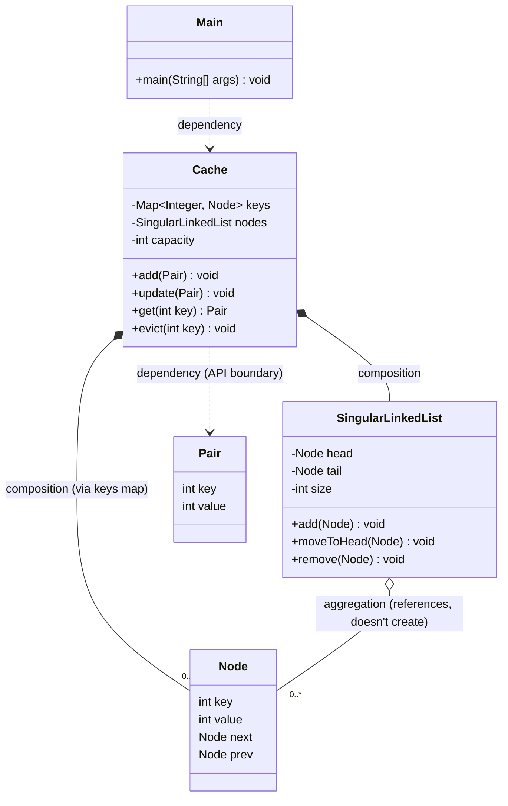

# LRU Cache — Implementation Documentation

A Least-Recently-Used (LRU) cache implemented in Java using a `HashMap` (for O(1) key lookup) combined with a custom intrusive doubly-linked list (for O(1) recency tracking).

> **Note on code health:** While documenting this implementation, I found that the linked list and the "evict on full" behavior are not working as intended. These are called out explicitly in [Gaps & TODOs](#8-gaps--todos) rather than glossed over — this doc describes what the code *actually does*, not what it was meant to do.

---

## 1. Problem Statement

Model a fixed-capacity key-value cache that evicts the **least recently used** entry when it runs out of space, while keeping add/update/get at O(1) time complexity. This is the classic "LRU Cache" LLD/DSA interview problem (same shape as LeetCode 146), implemented here as a standalone package rather than a single method.

---

## 2. Functional Requirements

From `read.me.md`:

**Implemented:**
- Add a new `<k, v>` pair to the cache (`Cache.add`).
- Reject an add if the key already exists (`Cache.add` no-ops on duplicate key).
- Get a value by key, which should mark it as most recently used (`Cache.get` — the *intent* is implemented, but see the bug note in §8; the recency bookkeeping underneath it is broken).
- Manually evict a specific key (`Cache.evict`).
- Update the value of an existing key, which should mark it as most recently used (`Cache.update` — not in the original requirements doc, but present in code).

**Planned / Not Implemented:**
- **Automatic eviction of the LRU entry when the cache is full.** The requirement explicitly states "a victim must be chosen (the LRU pair)" — the current code does not do this (see §8).
- O(1) time complexity for add/update/get — **not actually achieved**, because the underlying linked list is broken (see §8). The map lookups are O(1); the list operations that are supposed to be O(1) instead corrupt the list's state.

---

## 3. Architecture Overview

### Classes

| Class | Role |
|---|---|
| `Cache` | Public API — the LRU cache itself. Owns a `Map<Integer, Node>` for lookup and a `SingularLinkedList` for recency order. |
| `SingularLinkedList` | Despite the name, a **doubly** linked list (nodes have `next` and `prev`). Tracks `head` (most recently used) and `tail` (least recently used). |
| `Node` | Intrusive list node — holds the cache entry's `key`/`value` *and* its own `next`/`prev` pointers. Doubles as both the cache record and the list element. |
| `Pair` | Simple `(key, value)` DTO used at the `Cache` API boundary (input to `add`/`update`, return type of `get`). |
| `Main` | Entry point; smoke-test-style driver that inserts 10 pairs into a capacity-5 cache. |

All classes live in the default (unnamed) package. `Cache`, `Node`, and `Pair` use Lombok's `@AllArgsConstructor` (in addition to explicit custom constructors in `Cache` and `Node`); `Main` also carries `@AllArgsConstructor`, which has no effect since `Main` has no fields and is never instantiated.

### Relationships

- **Cache → SingularLinkedList**: composition. The list has no meaning or lifecycle outside its owning `Cache`.
- **Cache → Node (via `keys`)**: composition. `Cache` is what creates every `Node` (`new Node(pair.key, pair.value)` in `add`); the map and the list both just hold references to the same `Node` instances.
- **SingularLinkedList → Node**: aggregation. The list manipulates `next`/`prev` on nodes it's given but doesn't create them.
- **Cache → Pair**: dependency. `Pair` is a transient DTO passed in and returned out; `Cache` doesn't hold onto `Pair` instances.
- **Main → Cache**: dependency. `Main` calls `Cache`'s public API.

---

## 4. Class-by-Class Reference

### `Cache`

**Purpose:** The LRU cache itself — the public-facing object a client interacts with.

**Fields:**
| Field | Type | Why |
|---|---|---|
| `keys` | `Map<Integer, Node>` | O(1) lookup from key → the node holding that key's value and list position. |
| `nodes` | `SingularLinkedList` | Tracks recency order so the least-recently-used node can (in theory) be found/evicted in O(1). |
| `capacity` | `int` | Max number of entries the cache may hold. |

**Methods:**

- **`Cache(int capacity)`** — initializes an empty `keys` map, an empty `nodes` list, and sets capacity. This is the real constructor used by `Main`. (The Lombok-generated 3-arg `@AllArgsConstructor` constructor also exists but is unused.)

- **`void add(Pair pair)`** — Inserts a new key. Pre-conditions checked: cache not already at capacity, and key not already present. On success: creates a `Node`, stores it in `keys`, and appends it to `nodes`. **Side effect:** if either pre-condition fails, this silently no-ops — it does **not** evict anything to make room (see §8).

- **`void update(Pair pair)`** — If the key exists, overwrites the node's `value` and re-touches it in the list (`nodes.remove(node)` then `nodes.add(node)`, intended to move it to the most-recently-used position). No-ops if the key is absent.

- **`Pair get(int key)`** — Looks up the node by key; returns `null` on miss. On hit, touches recency the same way as `update` (remove + re-add), then returns a **new** `Pair(key, node.value)` — note this is a fresh `Pair`, not a cached instance.

- **`void evict(int key)`** — Manual, caller-driven eviction of a specific key: removes the node from the list and from the map. This is **not** automatic LRU-based eviction (no caller in the codebase picks "the least recently used key" to pass in — see §8); it is a general-purpose "remove this key" method.

### `SingularLinkedList`

**Purpose:** Models the recency ordering of cache entries — conceptually, head = most recently used, tail = least recently used. (Named "Singular" but nodes have both `next` and `prev`, so structurally it's doubly linked.)

**Fields:** `head`, `tail` (both `Node`), `size` (`int`, intended entry count).

**Methods:**

- **`void add(Node node)`** — Intended to prepend `node` as the new head (most recently used). **This has a critical bug** — see §8. In the empty-list case it does `head = tail = node`. In the non-empty case it's supposed to link `node` in front of the old head, but the branch condition (`head == tail`) means this "non-empty" branch is effectively unreachable once there's exactly one element, because after the first insert `head == tail` stays true for the *next* call too, re-triggering the "empty list" branch instead.

- **`void moveToHead(Node node)`** — Unlinks `node` from its current position and relinks it at the head. **Dead code** — never called from anywhere in the codebase; `Cache.update`/`Cache.get` instead use `remove()` + `add()` to achieve (an intended) equivalent effect.

- **`void remove(Node node)`** — Unlinks `node` by patching `node.prev.next` and (if present) `node.next.prev`. Does **not** update `head`/`tail` if the removed node was the head or tail, and does **not** decrement `size`. Will throw `NullPointerException` if `node.prev` is `null` (i.e. if `node` is currently the head) — see §8.

### `Node`

**Purpose:** A single cache entry, doubling as the doubly-linked-list element that tracks its own position.

**Fields:** `key`, `value` (`int`), `next`, `prev` (`Node`) — self-explanatory; no non-obvious ones.

**Methods:** Only the explicit `Node(int key, int value)` constructor, which nulls out `next`/`prev`. No other behavior (pure data holder).

### `Pair`

**Purpose:** A transient `(key, value)` DTO for crossing the `Cache` API boundary — what callers pass to `add`/`update` and get back from `get`.

**Fields:** `key`, `value` (`int`).

**Methods:** None beyond the Lombok-generated all-args constructor.

### `Main`

**Purpose:** Manual smoke-test / demo entry point.

**Behavior:** Creates a `Cache` with capacity 5, then loops `i = 0..9` constructing `Pair(i % 5, i)` and calling `cache.add(pair)`. Because keys cycle `0,1,2,3,4,0,1,2,3,4`, the second pass of 5 calls all hit the "key already exists" no-op branch in `Cache.add` — so this driver never actually exercises `update`, `get`, `evict`, or the (missing) eviction-on-full path. It doesn't print or assert anything, so running it validates nothing beyond "does it throw."

---

## 5. Design Patterns Used

**None.** No GoF design pattern is genuinely present in this code. The map + doubly-linked-list combination is the standard *data-structure technique* for building an O(1) LRU cache, not a design pattern — there's no Strategy, Factory, Observer, Decorator, etc. here.

### Potential Improvements

- **Strategy pattern for eviction policy**: if this were extended beyond pure LRU (e.g. to support LFU or TTL-based eviction later), extracting an `EvictionPolicy` interface that `Cache` depends on would let the policy vary independently of `Cache`'s structure. Not needed for LRU alone, but worth mentioning if an interviewer asks "how would you support other policies?"
- **Generics**: `Cache`, `Node`, and `Pair` are hardcoded to `int` keys and `int` values. A real-world cache would be generic (`Cache<K, V>`).

---

## 6. Key Flows

### Flow: Add a new key (happy path)
1. Client calls `Cache.add(pair)`.
2. `Cache` checks `capacity == keys.size()` — if full, returns immediately (no eviction — see §8).
3. `Cache` checks `keys.containsKey(pair.key)` — if already present, returns immediately (no update either).
4. `Cache` creates `new Node(pair.key, pair.value)`.
5. `Cache` stores it in `keys`.
6. `Cache` calls `nodes.add(node)` to place it at the head of the recency list. **(Buggy — see §8: this does not correctly preserve previously-added nodes in the list.)**

### Flow: Update an existing key's value
1. Client calls `Cache.update(pair)`.
2. `Cache` looks up the node via `keys.get(pair.key)`; no-ops if absent.
3. `Cache` overwrites `node.value`.
4. `Cache` calls `nodes.remove(node)` then `nodes.add(node)` to move it to the most-recently-used position. **(Buggy — `remove` can NPE if `node` is the current head; `add` has the head/tail bug described in §8.)**

### Flow: Get a value (cache hit)
1. Client calls `Cache.get(key)`.
2. `Cache` looks up the node; returns `null` on miss.
3. On hit, touches recency the same way as `update` (`remove` + `add` — same bugs apply).
4. Returns a new `Pair(key, node.value)` to the caller.

### Flow: Manual eviction by key
1. Client calls `Cache.evict(key)`.
2. `Cache` looks up the node; no-ops if absent.
3. `Cache` calls `nodes.remove(node)`, then removes the key from `keys`.
4. This is a direct, caller-specified eviction — **not** "find and evict the LRU entry automatically." Nothing in the codebase computes "which entry is least recently used" and feeds it to this method.

### Flow that's missing: Automatic eviction when the cache is full
There is no flow for this. Per `Cache.add` step 2 above, when the cache is at capacity, an `add` call is simply dropped — the new pair is discarded and the existing contents are untouched. This directly contradicts the stated requirement ("a victim must be chosen"). See §8.

---

## 7. Gaps & TODOs

This section is the concrete "pick up here" list.

1. **`SingularLinkedList.add` is structurally broken for more than one node — `Not Implemented`/bug.**
   The guard is `if (head == tail)`, intended to mean "list is empty." But after the very first `add`, `head == tail` (both point at the same single node) — so the *second* call to `add` also takes the "empty list" branch (`head = tail = node`) instead of the intended prepend branch. This silently **orphans every previously-added node** from the list structure (they remain reachable via `Cache.keys`, but `head`/`tail` traversal only ever sees the single most-recently-added node). Net effect: after inserting N≥2 distinct keys, the list only "contains" (is traversable from) the very last one inserted.
   - Fix direction: the empty-list guard should be `head == null`, and the non-empty branch needs to also assign `tail` only when appropriate (currently `tail` is never reassigned at all after the first insert, anywhere in the class).

2. **`Cache.add` does not evict on full — `Not Implemented` (contradicts the stated requirement).**
   When `capacity == keys.size()`, `add` just returns — no victim is chosen, no node is evicted. The explicit requirement in `read.me.md` ("a victim must be chosen (the LRU pair)") has no corresponding code. There is no code path anywhere that reads `nodes.tail` to find/evict the LRU entry automatically.

3. **`SingularLinkedList.remove` can throw `NullPointerException`.**
   `node.prev.next = node.next` assumes `node.prev` is non-null. If `node` is the current head (`prev == null`), this throws. There's also no head/tail reassignment when the removed node *is* the head or tail, and `size` is never decremented here.

4. **`moveToHead` is dead code.**
   Defined but never called; `Cache.update`/`Cache.get` use `remove()` + `add()` instead, which — given bug #1 and #3 — do not reliably reproduce "move to most-recently-used" semantics.

5. **`size` field on `SingularLinkedList` is effectively unused/unreliable.**
   Only incremented in the (practically unreachable, per bug #1) non-empty branch of `add`; never decremented in `remove`. Never read by `Cache`.

6. **No generics.** Cache is hardcoded to `int` keys/values — would need to become `Cache<K, V>` / `Node<K, V>` / `Pair<K, V>` for general use.

7. **No concurrency handling.** `HashMap` and raw field mutation are not thread-safe; fine for a single-threaded interview setting, called out here as a known limitation rather than something silently patched.

8. **`Main` doesn't actually exercise most of the API.** Its loop only ever calls `add`, and only the first 5 of its 10 calls do anything (the rest hit the duplicate-key no-op). `update`, `get`, and `evict` are never called, and nothing is printed/asserted, so running `Main` doesn't demonstrate correctness of anything beyond "`add` doesn't crash on first insert."

9. **No accessors.** No `size()`/`isEmpty()`/`contains()` on `Cache`, no way to inspect cache state from outside without triggering recency side effects.

---

## 8. Interview Prep Notes

**Why this design (as far as it's implemented)?**
The intended shape — `HashMap<K, Node>` for O(1) lookup plus an intrusive doubly-linked list for O(1) recency reordering — is the textbook approach to an O(1) LRU cache (same idea as LeetCode 146's standard solution). The *idea* embedded in the code (keep `head` = MRU, `tail` = LRU, evict from `tail` on overflow) is sound; the implementation of the list just doesn't deliver on it.

**What would break at scale?**
- Everything is in-memory (`HashMap` + a plain object graph) — a second instance (e.g. a second server) would have a completely independent, inconsistent cache. No persistence, no distribution.
- No concurrency control — concurrent `get`/`add`/`update` calls from multiple threads would race on the map and on the list pointers.
- Fixed `int`-only keys/values cap its usefulness as a general-purpose cache.

**What would you add next?**
Directly from §8's gap list, in priority order:
1. Fix `SingularLinkedList.add`'s empty-list guard (`head == null`, not `head == tail`) and make sure `tail` is actually maintained.
2. Fix `remove` to null-check `node.prev`/`node.next` and correctly reassign `head`/`tail` when removing an end node.
3. Wire up automatic eviction: when `Cache.add` finds the cache full, evict `nodes.tail` before inserting the new node, instead of silently dropping the insert.
4. Decide whether `moveToHead` or `remove`+`add` is the canonical "touch" operation and delete the other to avoid two divergent code paths.
5. Add generics if this needs to be more than an `int`-keyed demo.
