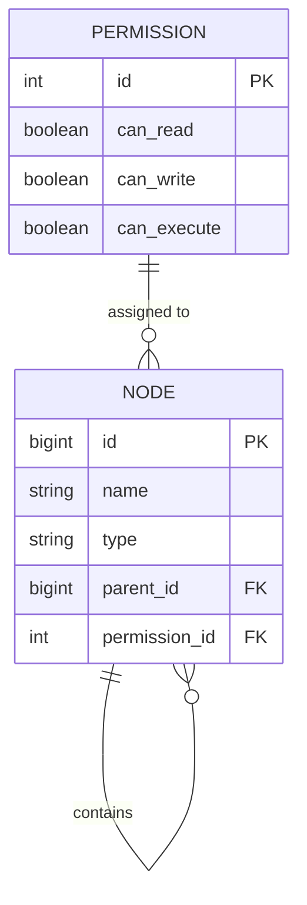

# File System — Low Level Design

A Java implementation of an in-memory hierarchical file system that models files and folders
as a single recursive entity, backed by a flat path index for O(1) lookup.

Module location: `LLD/FileSystem`
Dependencies: Lombok (`LLD/lib/lombok.jar`), JDK. No build tool — plain IntelliJ module (`LLD.iml`).

---

## 1. Problem Statement

The file system should support the following operations:

- Create a file or folder
- Read a file
- Update metadata for a file or folder
- Update data for a file
- Delete a file or folder

The file system should also support the following features:

- Hierarchical structure with folders and subfolders
- File and folder permissions (read, write, execute)
- Support for different file types (text, binary, images, etc.)
- Seek for a file should be as efficient as possible

---

## 2. Package Structure

```
FileSystem/
├── entities/
│   ├── Node.java            # unified file + folder entity (composite)
│   ├── FileSystem.java      # singleton store / repository + path index
│   ├── Data.java            # file payload (bytes + size)
│   ├── MetaData.java        # placeholder for descriptive attributes
│   └── Permissions.java     # read / write / execute / delete flags
└── services/
    └── FileSystemManager.java   # operations: create, update, delete, display
```

Two layers:

| Layer   | Package    | Responsibility                                             |
|---------|------------|------------------------------------------------------------|
| Entity  | `entities` | State + storage. What a node *is*, and where nodes live.   |
| Service | `services` | Behaviour. Path parsing, tree walking, lifecycle of nodes. |

There is no `Main` / driver class and no test class in the package.

---

## 3. Entity Model

### 3.1 `Node` — the core abstraction

`Node` represents **both** a file and a folder. There is no `File` class and no `Folder` class;
the distinction is carried by the `isFile` flag. This is the central design decision of the
solution — a self-referencing composite.

Lombok: `@Getter @Setter @AllArgsConstructor @Builder`. Fields are declared with default
(package-private) visibility; access from `services` goes through the generated getters/setters.

**Fields**

| Field          | Type          | Meaning                                                               |
|----------------|---------------|------------------------------------------------------------------------|
| `id`           | `Long`        | Surrogate identifier, assigned by the store on first save              |
| `name`         | `String`      | Last path segment, e.g. `notes.txt`                                    |
| `pathFromRoot` | `String`      | Full absolute path, e.g. `/home/rajan/notes.txt` — also the index key  |
| `isFile`       | `Boolean`     | `true` = file, `false` = folder                                        |
| `createdAt`    | `Timestamp`   | Set at construction                                                    |
| `updatedAt`    | `Timestamp`   | Set at construction, refreshed on create-touch and on update           |
| `permissions`  | `Permissions` | Access flags for this node                                             |
| `data`         | `Data`        | File payload; stays `null` for folders                                 |
| `metaData`     | `MetaData`    | Descriptive attributes                                                 |
| `parent`       | `Node`        | Upward link; `null` for a root-level node                              |
| `children`     | `List<Node>`  | Downward links; `null` for a file, and also `null` for an empty folder  |

`children == null` is **not** a reliable indicator of a file, because a folder may legitimately be
empty — the list is only allocated lazily when the first child is saved. `isFile` is the only
authority on file-vs-folder.

**Static factory**

```java
public static Node create(String pathFromRoot, String name, Node parent, boolean isFile)
```

Builds a node via the Lombok builder and initialises:

- `name`, `pathFromRoot`, `isFile`, `parent` from arguments
- `createdAt` and `updatedAt` to `new Timestamp(System.currentTimeMillis())`
- `permissions` to a fresh default `Permissions()`

Not initialised by the factory: `id` (the store assigns it), `data`, `metaData`, `children`.

### 3.2 `Permissions`

Lombok: `@Getter @Setter @Builder @AllArgsConstructor`

| Field        | Type      |
|--------------|-----------|
| `id`         | `Long`    |
| `canRead`    | `boolean` |
| `canWrite`   | `boolean` |
| `canExecute` | `boolean` |
| `canDelete`  | `boolean` |

An explicit no-arg constructor defines the **default policy**: `canRead = true`, and
`canWrite = canExecute = canDelete = false`. So every node created through `Node.create`
starts out read-only.

The `id` field exists so that permission rows can be shared/deduplicated — the same intent as the
`PERMISSION` table in the ER model below, where many nodes point at a small set of predefined
permission rows rather than each owning a private copy.

No operation in the package reads these flags — they are modelled and stored, never enforced.

### 3.3 `Data`

Lombok: `@Getter @Setter @Builder @AllArgsConstructor`

| Field     | Type     | Meaning             |
|-----------|----------|---------------------|
| `content` | `byte[]` | Raw file content    |
| `size`    | `long`   | Size of the content |

Holding content as `byte[]` is what satisfies the "support for different file types (text, binary,
images)" requirement — the file system stays type-agnostic and never interprets the bytes.
File *type* is therefore not a field; it is implied by the content and the name/extension.
`size` is a plain field, not derived from `content.length`, so it is whatever the caller sets.

### 3.4 `MetaData`

```java
public class MetaData {
}
```

An empty placeholder class. It exists so that `Node` can carry a metadata reference and
`FileSystemManager.update` can accept and swap one, but it defines no attributes yet.

### 3.5 `FileSystem` — singleton store

Lombok: `@Getter` on the class. This is the repository / storage layer.

```java
private static final FileSystem INSTANCE = new FileSystem();
private final Map<String, Node> nodesByPath = new HashMap<>();
private long nextId = 1;
private FileSystem() { }
public static FileSystem getInstance() { return INSTANCE; }
```

- **Eager singleton.** Instance created at class-load, private constructor, exposed via
  `getInstance()`. Not thread-safe beyond the safe publication of `INSTANCE` itself — the
  `HashMap` and the `nextId` counter have no synchronisation.
- **`nodesByPath`** is a flat `HashMap` from absolute path → node. This is the answer to the
  "seek should be as efficient as possible" requirement: lookup is O(1) on the full path instead
  of O(depth) tree traversal from the root.
- **`nextId`** is a simple incrementing counter for surrogate ids.

**Methods**

`Node findNodeByPath(String pathFromRoot)`
Single map lookup. Returns `null` when absent.

`void save(Node node)`

1. If `node.getId() == null`, assigns `nextId++` — id assignment happens exactly once per node,
   which is what lets `save` act as both insert and update.
2. Puts the node into `nodesByPath` keyed by its path (idempotent for an existing node).
3. If the node has a parent, lazily initialises `parent.children` to a new `ArrayList` when it is
   `null`, then **appends** the node to it.

Step 3 is an unconditional append, not an upsert. Saving a node that is already linked to its
parent adds a second reference to the same child — see §4.1 and §4.2, both of which re-save
existing nodes.

`void delete(Node node)`

1. Null-guard, returns silently.
2. Removes the node from `nodesByPath`.
3. If it has a parent, removes it from `parent.children`, so the tree link is cut as well as the
   index entry.

The two data structures — the flat index and the parent/child tree — are both maintained here;
`save`/`delete` are the only places that keep them in sync.

---

## 4. Service Layer — `FileSystemManager`

Holds a single field: `private final FileSystem fileSystem = FileSystem.getInstance();`
Stateless otherwise — all state lives in the singleton store.

### 4.1 `create(String path, boolean isFile)`

Creates a node at `path`, **creating every missing intermediate folder along the way**
(a `mkdir -p` style create).

Walk-through:

1. `path.split("/")` splits the path into segments. Because an absolute path starts with `/`,
   `parts[0]` is the empty string.
2. A `StringBuilder pathFromRoot` accumulates the prefix path; `parent` tracks the node handled
   in the previous iteration.
3. For each segment:
   - Empty segments are skipped (`continue`) — this handles the leading `/` and any `//`.
   - The segment is appended as `"/" + part`, so after i steps `pathFromRoot` is the absolute
     path of the current level.
   - `isLast` is computed as `i == parts.length - 1`.
   - `findNodeByPath(prefix)` checks whether that level already exists.
     **Missing** → `Node.create(prefix, part, parent, isFile && isLast)`. The `isFile && isLast`
     expression is what guarantees every intermediate segment is created as a folder, and only the
     final segment can become a file.
     **Present** → the existing node is reused as-is.
   - Either way, `updatedAt` is stamped and `fileSystem.save(node)` is called — so traversing
     through an existing folder also touches it.
   - `parent = node` for the next iteration.

So `create("/a/b/c.txt", true)` yields folder `/a`, folder `/a/b`, file `/a/b/c.txt`, linked
parent↔child at each level, all three registered in the path index.

Example trace for `create("/a/b/c.txt", true)`:

| i | part    | prefix       | isLast | action                |
|---|---------|--------------|--------|-----------------------|
| 0 | `""`    | —            | false  | skipped               |
| 1 | `a`     | `/a`         | false  | create folder, save   |
| 2 | `b`     | `/a/b`       | false  | create folder, save   |
| 3 | `c.txt` | `/a/b/c.txt` | true   | create **file**, save |

**Behaviour to be aware of.** Because `save` is called on every level including levels that already
existed, and `save` appends unconditionally to `parent.children`, a second call that walks through
an existing path duplicates entries in the parent's child list. After
`create("/a/b", false)` followed by `create("/a/c", false)`, `/a` appears twice inside the root
level's children and `/a/b`'s entry is re-appended under `/a`. The flat index stays correct (map
`put` on the same key overwrites), so lookups are unaffected; only the tree links accumulate
duplicates, which then show up as repeated subtrees in `display` and as repeated recursion in
`delete`. Guarding the touch-and-save behind `if (node == null || isLast)`, or making `save`
check `contains` before appending, removes it.

Also note: `create` never rejects creating a child under an existing *file*, so
`create("/a.txt/b.txt", true)` will happily nest a node under a file.

### 4.2 `update(String path, MetaData metaData, Data data, boolean isFile)`

Source comment: *"either the metadata has been changed or the data itself has changed"*.

A single entry point for both update flavours in the problem statement — "update metadata for a
file or folder" and "update data for a file" — dispatching on which of the two arguments is
non-null.

```java
Node node = fileSystem.findNodeByPath(path);

if (!isFile && metaData != null) {          // folder + metadata: apply and save
    node.setMetaData(metaData);
    node.setUpdatedAt(now);
    fileSystem.save(node);
}
if (metaData != null) node.setMetaData(metaData);
else                  node.setData(data);
node.setUpdatedAt(now);
fileSystem.save(node);
```

- The node is resolved by exact absolute path — O(1) through the index.
- `metaData != null` wins over `data`: passing both in one call silently ignores `data`.
- The first branch is a special case for folders that the second branch already covers, so for a
  folder + metadata call the same two setters run twice and `save` runs twice.

**Behaviour to be aware of.**

1. No null check on `node` — an unknown `path` throws `NullPointerException` on the first setter
   rather than reporting "not found".
2. Calling `save` on an already-linked node re-appends it to `parent.children` (§3.5), so every
   update duplicates the node in its parent's child list — twice over for the folder + metadata
   path, which saves twice.
3. `isFile` is a caller-supplied argument even though the node itself knows via `getIsFile()`, so
   a wrong flag just changes which redundant branch runs.
4. Nothing prevents setting `data` on a folder.

### 4.3 `delete(Node node)`

Recursive delete, takes a `Node` rather than a path.

```java
if (node == null) return;
if (node.getIsFile()) { fileSystem.delete(node); return; }
for (Node child : node.getChildren()) delete(child);
```

- Null-guard.
- A file is removed directly from the store — index entry plus unlink from the parent's child list.
- A folder recurses into its children.

**Behaviour to be aware of.**

1. After recursing, the folder node itself is never passed to `fileSystem.delete(...)`, so
   directories stay in `nodesByPath` and in their parent's child list while their file descendants
   are removed.
2. An empty folder reaches the for-loop with `children == null` (the list is only allocated on
   first child save) and throws `NullPointerException`.
3. `fileSystem.delete(child)` removes the child from `node.getChildren()` — the very list the
   enhanced-for is iterating — so the iterator's modCount check fires and throws
   `ConcurrentModificationException` for a folder with any file children. Iterating a copy, or
   using an explicit `Iterator` with `it.remove()`, or clearing the child list after the loop and
   then deleting the folder itself, all fix it.
4. There is no `delete(String path)` overload, so callers must resolve the node themselves via
   `FileSystem.findNodeByPath`.
5. `canDelete` on `Permissions` is not consulted.

### 4.4 `display(Node node)`

Depth-first print of the subtree rooted at `node`:

```
Node: <pathFromRoot>, isFile: <true|false>
```

then recurses into `node.getChildren()`. Same `null`-children consideration as `delete` — a leaf
file (and an empty folder) has `children == null`, so the recursion reaches the loop with `null`
and throws `NullPointerException`.

### 4.5 `displayFileSystem()`

Iterates **every** entry of `fileSystem.getNodesByPath()` and calls `display` on each value.
The local variable is named `roots`, but the map is flat and holds every node at every depth — not
just roots — so each node is printed once as a map entry and again for every ancestor whose DFS
walks down to it. Output therefore repeats subtrees rather than printing the tree once. Filtering
to `entry.getValue().getParent() == null` would print each tree exactly once.
`getNodesByPath()` is available here because of the class-level `@Getter` on `FileSystem`.

---

## 5. Data Structures and Complexity

| Operation                  | Cost | Why                                                       |
|----------------------------|------|-----------------------------------------------------------|
| Find node by absolute path | O(1) | `HashMap` lookup on the full path string                  |
| Create a node              | O(d) | d = number of segments in the path; one map op per level  |
| Save / index a node        | O(1) | map put + list append                                     |
| Delete a single node       | O(c) | map remove O(1) + `List.remove` on parent's children O(c) |
| Recursive delete of subtree| O(n) | n = nodes in the subtree                                  |
| Display subtree            | O(n) | DFS                                                       |

The dual representation is deliberate:

- **`Map<String, Node>`** — direct addressing, satisfies "seek should be as efficient as possible".
- **parent/children links** — preserve hierarchy for traversal, recursive delete, and display.

Trade-off accepted by this design: paths are stored denormalised on each node (`pathFromRoot`),
so a rename or a move would require rewriting the path of every descendant and re-keying them in
the index. There is no rename/move operation in the package, so that cost is not paid today.

Memory-wise, every node is referenced twice (map + parent's child list), and `Data.content` is
held fully in heap — there is no streaming or paging of file content.

---

## 6. Design Patterns Used

| Pattern            | Where                                              | Purpose                                                                    |
|--------------------|----------------------------------------------------|----------------------------------------------------------------------------|
| **Composite**      | `Node` with `children` / `parent`                  | Files and folders are treated uniformly by `delete` / `display`            |
| **Singleton**      | `FileSystem.INSTANCE`                              | One global store, one id sequence, private constructor                     |
| **Repository**     | `FileSystem` save / delete / find                  | Persistence concerns kept out of the service                               |
| **Builder**        | Lombok `@Builder` on `Node`, `Data`, `Permissions` | Readable construction of wide objects                                      |
| **Static factory** | `Node.create(...)`                                 | One place that fixes creation invariants (timestamps, default permissions) |
| **Service layer**  | `FileSystemManager`                                | Operations separated from state                                            |

---

## 7. Persistence / ER Model

The design note carried over from the original readme:

> Because this data is fairly structured and has good relational characteristics, a relational
> database can back it (Oracle, say).
>
> There are predefined permission rows; each node holds a reference key to one of these rows,
> which determines the permissions for that node.
>
> Each file or folder is a `NODE`, and each row can self-reference another row when it is a folder.
> That self-reference is what gives the hierarchical structure of files and folders.



Mapping between the ER model and the code:

| ER column            | Java field                                    |
|----------------------|-----------------------------------------------|
| `NODE.id`            | `Node.id` (assigned by `nextId++`)            |
| `NODE.name`          | `Node.name`                                   |
| `NODE.type`          | `Node.isFile`                                 |
| `NODE.parent_id`     | `Node.parent`                                 |
| `NODE.permission_id` | `Node.permissions` (`Permissions.id`)         |
| —                    | `Node.pathFromRoot` (index key, denormalised) |
| —                    | `Node.data`, `Node.metaData`, timestamps      |

The in-memory `HashMap<String, Node>` is the equivalent of an index on the path column.

---

## 8. Requirement Coverage

| Requirement                                  | Where it is handled                                                       |
|----------------------------------------------|---------------------------------------------------------------------------|
| Create a file or folder                      | `FileSystemManager.create(path, isFile)` — with auto-created parents      |
| Hierarchical structure, folders & subfolders | `Node.parent` / `Node.children`, built during `create`                    |
| Efficient seek                               | `FileSystem.nodesByPath` — O(1) absolute-path lookup                      |
| Permissions (read, write, execute)           | `Permissions` entity + `canDelete`; default read-only; **never enforced** |
| Different file types                         | `Data.content` as `byte[]` — content stays uninterpreted                  |
| Update metadata for a file or folder         | `FileSystemManager.update(path, metaData, null, isFile)` — see §4.2       |
| Update data for a file                       | `FileSystemManager.update(path, null, data, true)` — see §4.2             |
| Delete a file or folder                      | `FileSystemManager.delete(Node)` recursive — see §4.3                     |
| Read a file                                  | No dedicated operation; reachable via `findNodeByPath(path).getData()`    |

Not modelled: permission enforcement, symbolic links, a file-type enumeration, concurrency
control, size roll-up on folders, rename/move, and any `MetaData` attributes.

---

## 9. Current State of the Implementation

Working as intended:

- `Node` composite model, `isFile` as the sole file/folder discriminator
- Singleton store with dual index (flat path map + parent/child tree), kept in sync by
  `save` / `delete`
- Id assignment, timestamps, default read-only permissions
- `create` — path splitting, empty-segment skipping, intermediate folder creation, `isFile && isLast`
- `update` — resolves the node by absolute path and dispatches metadata vs data
- `FileSystem.save` and `FileSystem.delete` — both maintain the map and the parent link

Points a reviewer will land on (all detailed in §3.5 and §4):

1. `FileSystem.save` appends to `parent.children` unconditionally, so re-saving an existing node
   duplicates it in its parent's child list. Both `create` (touches every level) and `update`
   (saves on every call) re-save existing nodes, so duplicates appear in normal use.
2. `update` has no null check on the resolved node — an unknown path throws `NullPointerException`
   instead of reporting "not found". Its `!isFile && metaData != null` branch also duplicates work
   the common branch does immediately after.
3. `delete` never removes the folder node itself after recursing, hits `null` children on an empty
   folder, and mutates `children` through `fileSystem.delete` while iterating the same list
   (`ConcurrentModificationException`).
4. `display` recurses into `getChildren()` without a null check, so it reaches a leaf file's `null`
   children list.
5. `displayFileSystem` iterates all nodes in the flat map, not just roots, so subtrees print
   repeatedly.
6. There is no `read` operation, no `delete(String path)` overload, and no permission check on any
   operation.
7. `MetaData` is an empty class; `Data.size` is caller-supplied rather than derived.
8. `FileSystem` is not thread-safe (plain `HashMap`, unsynchronised `nextId`).
9. No `Main` / driver and no tests, so nothing exercises the code end to end.

---

## 10. Build and Run

Plain IntelliJ module, no Maven/Gradle:

- Module file: `LLD/LLD.iml` — declares `FileSystem` and `impl.VendingMachine` as source folders and a
  project-level `lombok` library.
- Lombok jar: `LLD/lib/lombok.jar` — must be on both the classpath and as an annotation processor,
  since every entity relies on generated getters/setters/builders.
- Source packages: `entities`, `services` (package roots are relative to `FileSystem/`).

Command line, from `LLD/FileSystem`:

```bash
javac -cp ../lib/lombok.jar -d out $(find . -name "*.java")
```

There is no entry point to run; add a `Main` with a `FileSystemManager` to exercise it.
